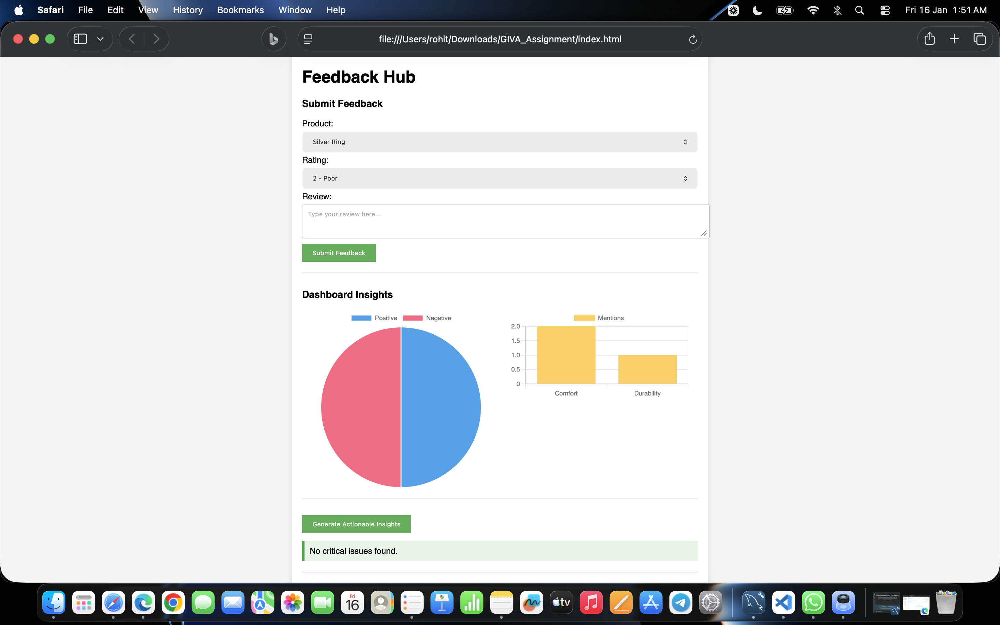
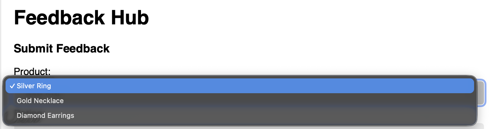
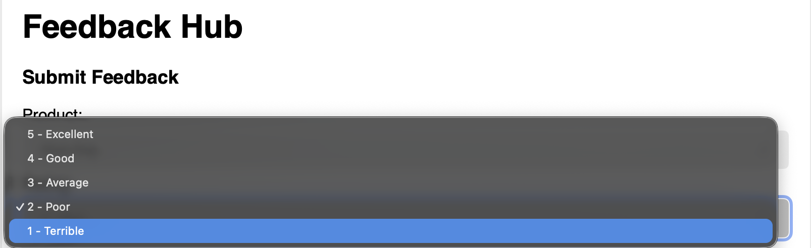
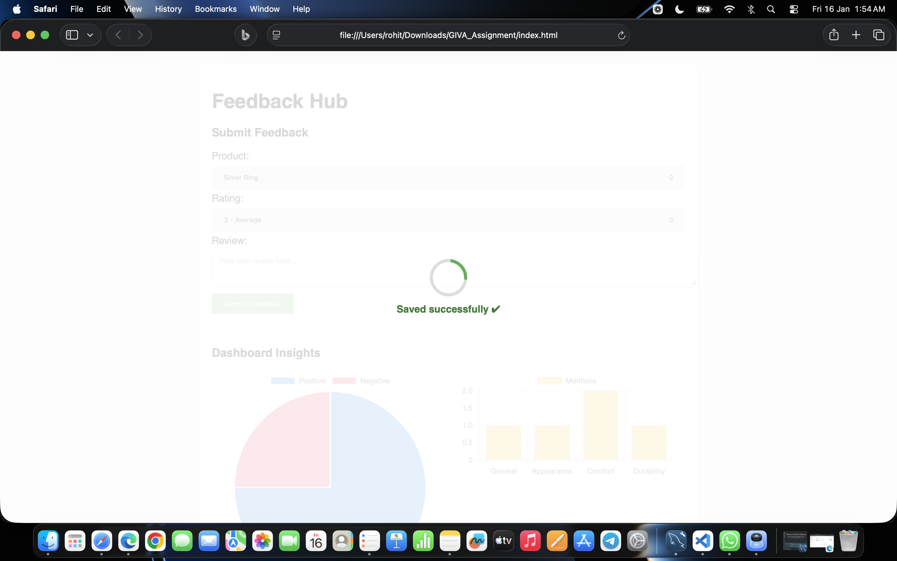

# Giva Customer Feedback Analyzer

This is a web-based dashboard designed to collect customer feedback for jewelry products, analyze the sentiment using rule-based logic, and visualize key insights.

This project was built as part of the "Feedback Hub" assignment.

## Features

* **Feedback Submission Form:** Collects Product, Rating, and Review Text.
* **Sentiment Analysis Engine:** Classifies reviews as **Positive** or **Negative** without using external AI libraries.
* **Theme Detection:** Automatically tags reviews with themes like **Durability**, **Comfort**, and **Appearance** based on keywords.
* **Interactive Dashboard:** Visualizes data using **Chart.js** (Pie Chart for Sentiment, Bar Chart for Themes).
* **Actionable Insights:** Automatically suggests improvements (e.g., "Fix durability issues") based on negative feedback patterns.
* **Persistent Storage:** Data is securely stored in a **MongoDB** database (Cloud/Atlas), ensuring feedback is not lost when the server restarts.

## Tech Stack

* **Frontend:** HTML5, CSS3, JavaScript (Fetch API), Chart.js.
* **Backend:** Node.js, Express.js.
* **Database:** MongoDB (Atlas) using Mongoose ODM.

## Logic Explanation

As per the assignment requirements, no external sentiment libraries (like NLTK or TextBlob) were used. The analysis is built on **pure logic**.

### 1. Sentiment Analysis Logic
The system uses a **"Bag of Words"** approach:
* I defined two lists: `POSITIVE_WORDS` (e.g., shiny, elegant) and `NEGATIVE_WORDS` (e.g., tarnish, broke).
* The code splits the review text into words.
* **Rule:** It counts matches for both lists.
    * If `Positive Count >= Negative Count` → **Positive Sentiment**.
    * Otherwise → **Negative Sentiment**.

### 2. Theme Detection Logic
The system scans for specific keywords to assign themes:
* **Comfort:** Checks for words like *light, heavy, fit, size*.
* **Durability:** Checks for words like *broke, fragile, quality*.
* **Appearance:** Checks for words like *shiny, polish, design*.

## Screenshots

### Dashboard View


### Drop Down Menu Options



### Submission Form



## Installation & Run Instructions

Follow these steps to run the project locally:

1.  **Clone the Repository**
    ```bash
    git clone https://github.com/rohitraj22/giva-feedback-analyzer
    cd giva-feedback-analyzer
    ```

2.  **Install Dependencies**
    ```bash
    npm install
    ```

3.  **Setup Environment Variables**
    * Create a new file named `.env` in the root folder.
    * Add your MongoDB Connection String inside it:
      ```env
      MONGO_URI=mongodb+srv://<username>:<password>@cluster0.mongodb.net/?appName=Cluster0
      ```

4.  **Start the Server**
    ```bash
    node server.js
    ```
    You should see: `Server running at http://localhost:3000` and `MongoDB Connected`.

5.  **Open the Frontend**
    * Go to the project folder.
    * Double-click `index.html` to open it in your browser.

## API Endpoints

* **POST** `/api/submit`: Accepts JSON `{product, rating, review}`. Saves to MongoDB and returns analysis.
* **GET** `/api/feedback`: Returns the history of all feedback stored in the database.